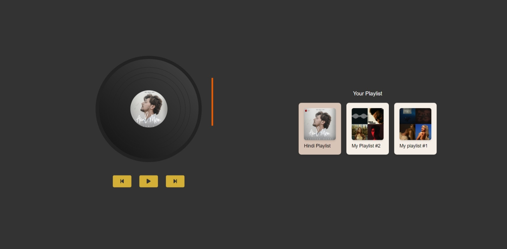

# Record Player - Spotify Vinyl Experience



## Overview

Record Player is a web application that brings the nostalgic experience of vinyl records to your digital Spotify music. This React-based app creates an immersive listening experience with a realistic vinyl interface that animates as your music plays.

## Features

- **Authentic Vinyl Experience**: Watch as the record spins and the needle moves during playback
- **Spotify Premium Integration**: Stream your Spotify playlists directly within the app
- **Playlist Navigation**: Browse and select from your personal Spotify library
- **Playback Controls**: Play, pause, and skip tracks with visual feedback
- **Responsive Design**: Enjoy the experience on various device sizes

## Demo

[View Live Demo](https://record-player-sigma.vercel.app/)

## Technologies Used

- React.js
- Spotify Web Playback SDK
- Web API
- Tailwind CSS
- Vite
- React Icons

## Prerequisites

- Spotify Premium account *(required for playback functionality)*
- Modern web browser
- Node.js and npm for local development

## Installation

1. Clone this repository:
   ```bash
   git clone https://github.com/subhajitroycode/record-player.git
   cd record-player
   ```

2. Install dependencies:
   ```bash
   npm install
   ```

3. Create a `.env` file in the root directory with your Spotify API credentials:
   ```
   VITE_CLIENT_ID=your_spotify_client_id
   VITE_REDIRECT_URI=http://localhost:5173
   ```

4. Start the development server:
   ```bash
   npm run dev
   ```

5. Open your browser and navigate to the provided local URL (usually http://localhost:5173)

## Usage

1. Log in with your Spotify Premium account
2. Browse your playlists in the horizontal scrolling menu
3. Select a playlist to load it onto the virtual record player
4. Use the controls beneath the record player to manage playback
5. Watch as the vinyl spins and the needle moves during playback

## Authorization Scopes

This application requires the following Spotify authorization scopes:

- `user-read-private`: To verify Premium subscription status
- `user-read-email`: For account identification
- `playlist-read-private`: To access your complete playlist library
- `streaming`: To enable playback control through the app

## Configuration for Development

To run this application in development mode, you'll need to:

1. Create a Spotify Developer account and register a new application
2. Configure your app in the Spotify Developer Dashboard:
   - Add `http://localhost:5173` as a Redirect URI
   - Note your Client ID (no Client Secret needed as we use PKCE)
3. Update your `.env` file with the Client ID

## Deployment

This application can be deployed to any static hosting service:

1. Build the production version:
   ```bash
   npm run build
   ```

2. Deploy the contents of the `dist` directory to your hosting service

3. Remember to add your production URL to the Redirect URIs in your Spotify Developer Dashboard

## Contributing

Contributions are welcome! Please feel free to submit a Pull Request.

1. Fork the repository
2. Create your feature branch (`git checkout -b feature/AmazingFeature`)
3. Commit your changes (`git commit -m 'Add some AmazingFeature'`)
4. Push to the branch (`git push origin feature/AmazingFeature`)
5. Open a Pull Request

## Acknowledgements

- [Spotify Web API](https://developer.spotify.com/documentation/web-api/)
- [Spotify Web Playback SDK](https://developer.spotify.com/documentation/web-playback-sdk/)
- [React Icons](https://react-icons.github.io/react-icons/)
- [Tailwind CSS](https://tailwindcss.com/)

## Socials

Connect with me on:
- X/Twitter: [@subhajitroycode](https://x.com/subhajitroycode)
- LinkedIn: [subhajitroycode](https://linkedin.com/in/subhajitroycode)
- Instagram: [@subhajitroycode](https://instagram.com/subhajitroycode)

Project Link: [github.com/subhajitroycode/record-player](https://github.com/subhajitroycode/record-player)